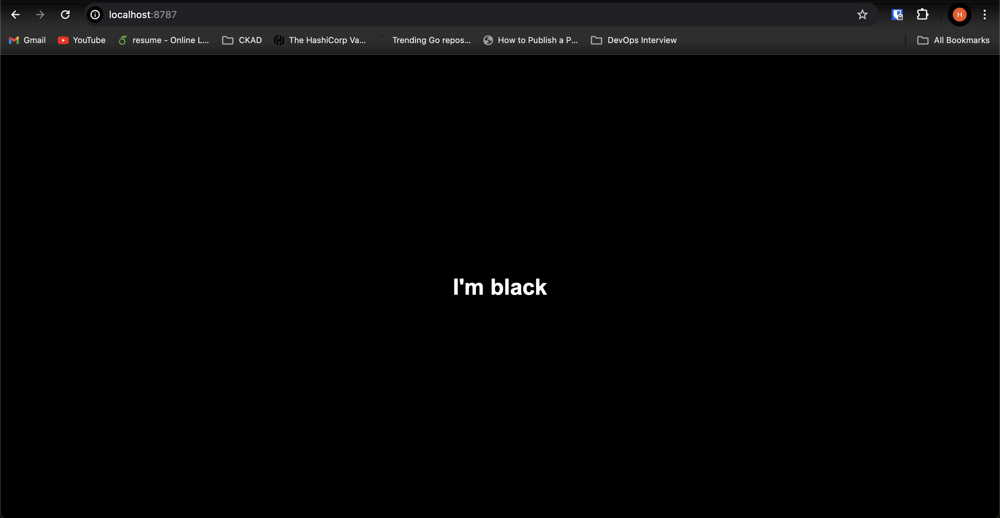

# Color Service

> Note: I created this image for the purpose of debugging and testing use cases such as when I want to test the environment's accessibility before deploying the actual application. 

### Overview
A static web server displaying a simple html page with a colored background. 

This image has been built upon the static-web-server image. The Static Web Server is a lightweight and fast production-ready web server suitable to serve static web files or assets. See more about it [here](https://static-web-server.net/).

**How to run the server?**
```
docker run -it --rm -p 8787:80 smhashim/color-service:v1
```



### Environment Variables

This image exposes two environment variables:

- `BACKGROUND_COLOR`: By default set to black
- `FONT_COLOR`: By default set to white

Apart from this, all the environment variables exposed by the static web server may also be set. See [this](https://static-web-server.net/configuration/environment-variables/) for a complete list of environment variables.